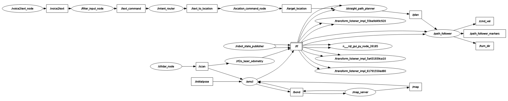

# VOICE_BASED_WHEELCHAIR

전신마비 장애인의 자율적인 이동을 지원하는 ROS 2 기반 음성 제어 전동휠체어 시스템.

## Video/GIF/rqt_graph
- 
- https://www.youtube.com/watch?v=IIPmA_FyYE8
- rqt_graph 토폴로지

- RViz 설정 파일: `dolchair.rviz` (TF/Path/Marker 시각화에 활용)

## Features(주요 기능)
- 음성 인식(STT)
  - `voice2text`: 마이크 입력 → Whisper 기반 전사(ko/en 등), 간단 VAD, 하이패스 필터, CPU/GPU 자동 선택
  - 출력 토픽: `/voice2text` (String)
- 명령 이해/라우팅
  - `llm_ros/filter_input_text`: 호출어 제거/전처리 → `/text_command`
  - `llm_ros/intent_router`: 장소 이동/저장 등 의도 분리 → 장소(`/text_to_location`) vs 일반(`/text_to_llm`)
  - `llm_ros/location_command`: 추출된 목적지 → `/target_location`
  - `llm_ros/llm_node`: OpenAI API로 자연어 → 제어 JSON(`/voice_cmd`)
- 경로 계획/추종
  - `path_planner/make_pathnplan`: 현재 위치 → 라벨 좌표(Path 생성, `/plan`)
  - `path_planner/path_follower`: 정렬(스핀) → 순수추종(Pure Pursuit) 주행, `/turn_dir`+`/auto_steer`+`/cmd_vel` 발행, 마커 시각화
- 저수준 구동 브리지
  - `MD_motor_drive : /cmd_vel > RPM으로 변환 후 모터 제어, 엔코더 > /odom 토픽으로 변환
- 로컬라이제이션/SLAM
  - LiDAR 오도메트리(rf2o) + EKF(robot_localization) + AMCL
  - 맵 생성/저장(slam_toolbox) 및 맵 서버 연동
  - TF: `map → odom → base_link → {laser_frame, imu_link}`
- 설정/리소스
  - 장소 라벨: `nav2_wheel/location/location.yaml`
  - 맵 파일: `nav2_wheel/maps/*.yaml|*.pgm`
  - URDF: `src/nav2_wheel/urdf/model.xacro`

- 권장 실행 순서
  1) 센서 드라이버
     ```
     # 개별 실행
     ros2 launch sllidar_ros2 view_sllidar_a2m8_launch.py
     ros2 launch wheelchair_slam_bringup rs_camera.launch.py
     ros2 launch myahrs_ros2_driver myahrs_ros2_driver.launch.py
     ros2 launch imu_preprocess imu_preprocess.launch.py
     ```

     ```
     # 센서 일괄 실행 

     ros2 launch wheelchair_slam_bringup sensors_bringup.launch.py imu_use_rviz:=false
     ```

  2) tf발행, rviz, slam, localization(AMCL), EKF(엔코더+imu)가 TF발행 실행+ **2d pose estimate 해줘야 함**
   
     1.맵파일 생성시 slam=True(localizaition 작동 X)
     ```
     ros2 launch nav2_wheel wheelchair.launch.py slam:=True
     ```
     2.Localization
     ```
     ros2 launch nav2_wheel wheelchair.launch.py 
     ```
     
  3) 음성 파이프라인(명령 처리)
      ```
      ros2 run llm_ros wake_word_detector
      ros2 run voice2text voice2text
      ros2 run llm_ros intent_router
      ros2 run llm_ros location_command
      ros2 run llm_ros llm_node
      ```

- SLAM(맵 생성/저장)
  ```
  ros2 run nav2_map_server map_saver_cli -f ~/src/nav2_wheel/maps
  ```

- 토픽 테스트 예시
  ```
  ros2 topic pub /target_location std_msgs/msg/String "{data: '화장실'}"
  ros2 topic pub -1 /voice2text std_msgs/msg/String "{data: '도리야 앞으로 1m 가줘.'}"
  ros2 topic pub -1 /voice2text std_msgs/msg/String "{data: '도리야 시계방향으로 90도 돌아줘.'}"
  ```
- 의존성(주요)
  - ROS 2 + nav2_map_server, nav2_amcl, slam_toolbox, robot_localization
  - Python: `openai`, `openai-whisper`, `torch`, `sounddevice`, `scipy`, `numpy`, `PyYAML`, `tf2_ros`
  - 하드웨어: 2D LiDAR(A2M8 등), myAHRS+, 마이크, 아두이노(시리얼 `/dev/ttyACM0` 기본)


test: ros2 topic pub -1 /target_location std_msgs/String
  "{data: '거실'}"
